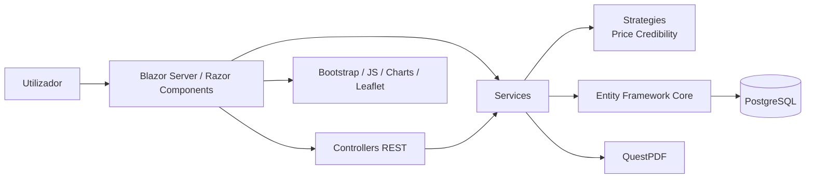

# DealRadar 🛒

**DealRadar** é uma plataforma web de **comparação de preços** desenvolvida em **ASP.NET Core Blazor**, no âmbito da unidade curricular de **Engenharia de Software II**.

A aplicação permite consultar produtos, comparar preços entre lojas, acompanhar histórico de preços, confirmar valores registados por outros utilizadores e gerar relatórios associados a lojas e produtos.

<p align="left">
  
  
  
  
</p>

---

## Funcionalidades

### Consulta e comparação

* pesquisa pública de produtos e preços;
* filtros por nome, categoria e loja;
* ordenação por preço, nome e data;
* visualização do melhor preço por produto;
* histórico de preços com representação gráfica;
* consulta de produtos associados a cada loja.

### Utilizadores e permissões

* autenticação com **ASP.NET Core Identity**;
* roles configuradas no arranque: `Admin`, `UserManager` e `User`;
* criação automática de administrador inicial em ambiente local;
* gestão de utilizadores, estado activo/inactivo e permissões;
* consulta de actividade de utilizadores;
* envio de mensagens para utilizadores registados.

### Gestão da plataforma

* gestão de produtos, lojas e categorias;
* associação de produtos a lojas;
* registo, confirmação e actualização de preços;
* cálculo de credibilidade dos preços com base em confirmações e antiguidade;
* painéis administrativos para entidades principais.

### Relatórios

* relatório geral de lojas;
* relatório por loja, com produtos e preços mais recentes;
* relatório por produto, com comparação entre lojas;
* exportação de relatórios em PDF.

---

## Arquitectura

O projecto segue uma arquitectura monolítica em **ASP.NET Core**, com separação por responsabilidades entre interface, controladores, serviços, modelos, DTOs e persistência.



### Organização principal

| Camada                | Responsabilidade                                       |
| --------------------- | ------------------------------------------------------ |
| `Components`          | páginas Blazor, layout, rotas e conta/autenticação     |
| `Controllers`         | endpoints REST para entidades principais               |
| `Services`            | regras de aplicação e operações de negócio             |
| `Services/Strategies` | estratégias de cálculo de credibilidade de preços      |
| `Models`              | entidades de domínio                                   |
| `DTOs`                | objectos de transferência de dados                     |
| `Data`                | `ApplicationDbContext` e configuração Entity Framework |
| `Migrations`          | evolução da base de dados                              |
| `wwwroot`             | CSS, JavaScript, imagens e assets estáticos            |

---

## Entidades principais

| Entidade                     | Descrição                                              |
| ---------------------------- | ------------------------------------------------------ |
| `Product`                    | produto pesquisável e comparável                       |
| `Store`                      | loja/supermercado com localização e URL do Google Maps |
| `Price`                      | preço de um produto numa loja                          |
| `PriceConfirmation`          | confirmação de preço feita por utilizadores            |
| `Category`                   | categoria de produto                                   |
| `User`                       | utilizador Identity com estado e role                  |
| `Message`                    | mensagens enviadas para utilizadores                   |
| `Report` / `GeneratedReport` | suporte à geração e consulta de relatórios             |

---

## Tecnologias

* **.NET 8 / ASP.NET Core** — base da aplicação;
* **Blazor Server / Razor Components** — interface web interactiva;
* **C#** — linguagem principal;
* **ASP.NET Core Identity** — autenticação, utilizadores e roles;
* **Entity Framework Core** — acesso e persistência de dados;
* **PostgreSQL** — base de dados relacional;
* **Swagger / Swashbuckle** — documentação e teste da API;
* **QuestPDF** — geração de relatórios PDF;
* **ScottPlot / Chart.js** — visualização de histórico de preços;
* **Bootstrap** — estilos e componentes visuais;
* **Leaflet / LeafletBlazor** — mapas e localização de lojas.

---

## Estrutura do projecto

```text
.
├── Components/          # Páginas Blazor, layouts, rotas e autenticação
├── Controllers/         # Controladores REST da API
├── Data/                # ApplicationDbContext
├── DTOs/                # Data Transfer Objects
├── Migrations/          # Migrações Entity Framework Core
├── Models/              # Modelos de domínio
├── Properties/          # Perfis de arranque
├── Services/            # Serviços de aplicação e estratégias
├── wwwroot/             # Assets estáticos, CSS, JS, imagens e Bootstrap
├── appsettings.json     # Configuração da aplicação
├── ESIID42025.csproj    # Projecto ASP.NET Core
├── esiid42025.sln       # Solução .NET
├── global.json          # SDK .NET preferencial
└── Program.cs           # Configuração, DI, Identity, Swagger e pipeline HTTP
```

---

## Pré-requisitos

* [.NET SDK 8.x](https://dotnet.microsoft.com/download/dotnet/8.0);
* PostgreSQL;
* ferramenta `dotnet-ef`, caso seja necessário aplicar migrações pela linha de comandos.

Instalar `dotnet-ef`:

```bash
dotnet tool install --global dotnet-ef
```

---

## Configuração

A aplicação usa PostgreSQL através da connection string `DefaultConnection`.

Para ambiente local, configura a ligação em `appsettings.Development.json` ou através de variáveis de ambiente:

```json
{
  "ConnectionStrings": {
    "DefaultConnection": "Host=localhost;Database=DealRadar;Username=<user>;Password=<password>"
  }
}
```

Também podes definir a connection string por variável de ambiente:

```bash
ConnectionStrings__DefaultConnection="Host=localhost;Database=DealRadar;Username=<user>;Password=<password>"
```

> Credenciais reais não devem ser guardadas no repositório.

---

## Execução

### 1. Restaurar dependências

```bash
dotnet restore
```

### 2. Aplicar migrações

```bash
dotnet ef database update
```

### 3. Executar a aplicação

```bash
dotnet run --project ESIID42025.csproj
```

Perfis de arranque configurados:

```text
HTTP:  http://localhost:5147
HTTPS: https://localhost:7083
```

Em ambiente de desenvolvimento, o Swagger fica disponível em:

```text
/swagger
```

---

## Utilizador administrador inicial

No arranque, o `Program.cs` cria as roles:

```text
Admin
UserManager
User
```

Também é criado um administrador inicial, caso ainda não exista:

```text
Email: admin@example.com
Password: Admin@123
```

> Estas credenciais destinam-se apenas a ambiente académico/local e devem ser alteradas antes de qualquer utilização real.

---

## Estado do projecto

Projecto académico desenvolvido para **Engenharia de Software II**, no tema **Plataforma de Comparação de Preços**.

A versão actual inclui autenticação, gestão de produtos, lojas, categorias, preços, confirmações, relatórios, exportação PDF, áreas administrativas e API REST.

---

## Autores

* [Simão Sousa](https://github.com/simaosousa10)
* [Luis Felipe Flores](https://github.com/LouisOfTheFlowers)
* [Pedro Cruz](https://github.com/pedrojcruz)
* [Deerpyyy](https://github.com/Deerpyyy)
* [Daniel Alves](https://github.com/DanielA1ves)
